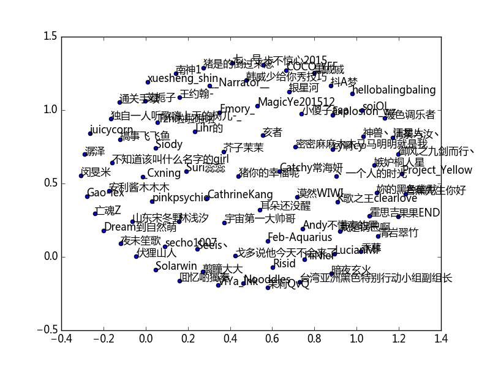
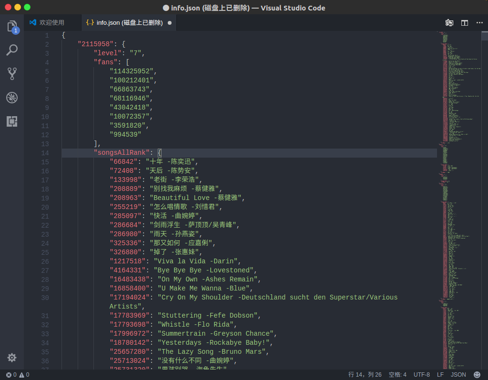
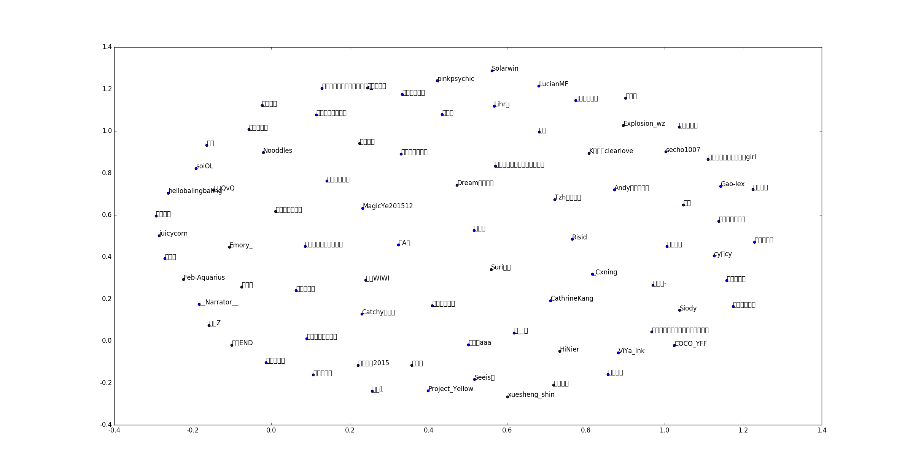

[TOC]
# 聚类结果：


## 使用方法：
* download这个项目
* python crawler.py 获得数据info.json,可以的话用我抓好的100个数据[./info.json](./info.json)，自己抓耗时也得几分钟。

json数据结构为:
    ```json
    {
      'user1Id':{
        'nikeName':nikeName,
        'fans':['fans1','fans2'],//粉丝列表前２０个
        'level':level,
        'songsAllRank':{'song1Id':'song1Name','song2Id':'song2Name'}／／所有时间听歌排行前１００
      }
    }
    ```
* python cluster即可得到图
## 需要：

* firefox 浏览器
* pip install selenium
* 浏览器驱动:
    * firefox[https://github.com/mozilla/geckodriver/releases](https://github.com/mozilla/geckodriver/releases)
        * chmod +x geckodriver
        * sudo cp geckodriver /usr/bin
    * chrome[chromedriver](./chromedriver)
        * chmod +x chromedriver
        * sudo cp chromedriver /sur/bin
    
## 个性化运行时可能需要修改的地方：

* crawler.py Ids换为您需要的id，也可保持不变
* crawler.py 中的crawler(100),100换为你想要抓取的人数，默认为100个


## 遇到过的障碍：
0. ifream 中的数据抓取
    ```python
    # 获取g_iframe中的元素信息
    driver.switch_to_frame('g_iframe')
    ```

1. selenium的span单击报错：
    * `</iframe> is not clickable at point` 
    * 解决办法：
    ```python
        # change
        songsAll = driver.find_element_by_css_selector('#songsall')
        action_chains = ActionChains(driver)
        action_chains.click(songsAll)
        action_chains.perform()
      
        # to
        songsAll = driver.find_element_by_css_selector('#songsall')
        driver.execute_script('arguments[0].click();',songsAll)
    ```
2. element找不到的情况：
    ```python
    # selenium隐式等待2秒
    driver.implicitly_wait(2)
    ```
3. pandas.read_json()会自动转换为时间戳(现已不用pandas方案，直接用json)
    ```python
    # 禁止转换
    pd.read_json(json.dumps(UserDict),convert_axes=False)
    ```
4. 字典过滤：
    ```python
    def dataCleaning(data):
        # 字典过滤,将采集数据中搜有时间听歌100首以上的前100首过滤出来
        return {k:v for(k,v) in data.items() if len(v['songsAllRank']) !=0}
    ```

5. matplotlib 中文字例
    未解决前：
    
    解决办法：
    * 第一步:[下载字体:msyh.ttf (微软雅黑)](./msyh.ttf.zip)放在系统字体文件夹下:`/usr/share/fonts`
    
        同时也复制并放在matplotlib的字体文件夹`/fonts/ttf`下
    
    * 第二步：修改matplotlib配置文件：如上图的目录删除`font.family`和`font.sans-serif`两行前的#，
    font.family 改为Microsoft YaHei
    并在font.sans-serif后添加中文字体Microsoft YaHei
    如图：
    
    
    * 第三步：删除~/.cache/matplotlib下文件fontList.py3k.cache

    